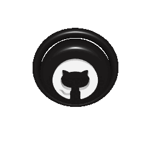

  

  

  

  

  
  
  
  
  
  
  

  
⠀⠀⠀⠀Languages & Database⠀⠀⠀⠀

  

    
    
    
    
    
  

  
⠀⠀⠀⠀Softwares & Services⠀⠀⠀⠀

  

    
    
    
    
    
  

  
⠀⠀⠀⠀Systems⠀⠀⠀⠀

  

    
    
    
    
    
  

## 🕶️ Philosophy
> _“I don’t build apps. I build moods.”_  
> _“Every pixel must earn its place.”_

---

## 📫 Connect
Feel free to fork, remix, or just observe in silence.  
No stars needed—just resonance.

